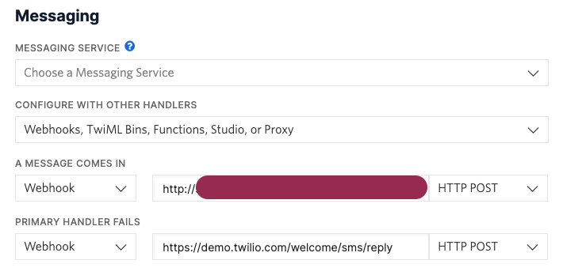

# BEHOLD, MIGHTY TWONGO

I needed a toy application to mess around with [Twilio](https://github.com/twilio/twilio-ruby) and [Mongoid](https://github.com/mongodb/mongoid). This is the result of a couple of hours of truly wasted labor.

## Running TWONGO
- `git clone`, `bundle install`, you know the deal.
- A local install of MongoDB (or just hack up the YML)
- A [Twilio](http://twilio.com) account.
- A phone number in Twilio for which you can set up a webhook:
   
- Something to forward requests from Twilio to your web service, assuming you're running this locally, because my goodness why would you bother putting it out in the _real_ world? (I used [ngrok](http://ngrok.com))
- Some environment variables:
    | Environment Variable | Description |
    | -------------------- | ----------- |
    | TWILIO_ACCOUNT_SID | Your Twilio account ID |
    | TWILIO_ACCOUNT_TOKEN | The token that goes with your Twilio account |
    | TWILIO_PHONE_NUMBER | A phone number you have purchased through Twilio |
    | HOST_URL | The host URL that you're using. ([ngrok](http://ngrok.com), remember?) |

Happy Twonging!